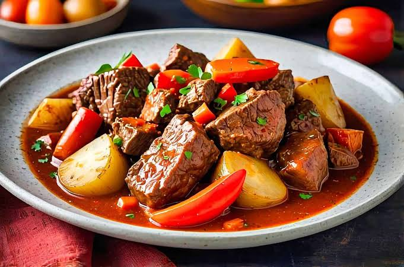

THIS IS THE PROGRAM SOURCE CODE

<!DOCTYPE html>
<html lang="en">
<head>
        <meta charset="UTF-8">
    <meta name="viewport" content="width=device-width, initial-scale=1.0">
    <title>Mami Mama Cooking</title>
    <link href="https://fonts.googleapis.com/css2?family=Poppins:wght@300;400;600&family=Cabin+Sketch:wght@700&display=swap" rel="stylesheet">
    <link href="https://fonts.googleapis.com/css2?family=Pacifico&display=swap" rel="stylesheet">
    <link href="https://fonts.googleapis.com/css2?family=Playfair+Display&display=swap" rel="stylesheet">
    <link href="https://fonts.googleapis.com/css2?family=Lobster&display=swap" rel="stylesheet">
    <link href="https://fonts.googleapis.com/css2?family=Montserrat:wght@600&display=swap" rel="stylesheet">
    
</head>
<body>
    <nav class="navigation">
        

            
        

        

            
            
        

    </nav>

    

        

            <h1>Mami Mama Cooking</h1>
            <h2>Warm Hugs in Every Dish</h2>
            
Simple & Hearty Delicious Recipes for Everyone

        

        <nav class="favorites-nav">
            <button id="all-recipes-btn" class="nav-btn active">🍲 All Recipes</button>
            <button id="favorites-btn" class="nav-btn">❤️ Favorites Only</button>
            <button class="nav-btn filter-btn" data-filter="chicken">🐔 Chicken</button>
            <button class="nav-btn filter-btn" data-filter="pork">🐖 Pork</button>
            <button class="nav-btn filter-btn" data-filter="beef">🐄 Beef</button>
            <button class="nav-btn filter-btn" data-filter="sweet">🍬 Sweet</button>
        </nav>

        

            <!-- Creamy Garlic Chicken -->
            

                
Chicken Recipe

                <button class="favorite-btn" aria-label="Add to favorites">♡</button>
                
                

                    <h3 class="recipe-title">Creamy Garlic Chicken</h3>
                    ⏲ 40 mins
                    <h2>Ingredients</h2>
                    <ul class="ingredients-list">
                        <li>2 boneless, skinless chicken breasts</li>
                        <li>1/2 tsp Italian seasoning</li>
                        <li>1/2 tsp salt</li>
                        <li>1 tsp Pepper & Garlic powder</li>
                        <li>3/4 cup heavy cream</li>
                        <li>1 cup chicken broth</li>
                    </ul>
                    <button class="view-recipe-btn">View Full Recipe</button>
                    

                        <h2>Process</h2>
                        <label class="checkbox-label">
                            <input type="checkbox" onchange="toggleCrossout(this)">
                            Slice breasts into thin cutlets.
                        </label>
                        <label class="checkbox-label">
                            <input type="checkbox" onchange="toggleCrossout(this)">
                            Season with Italian seasoning, salt, pepper. Coat with flour.
                        </label>
                        <label class="checkbox-label">
                            <input type="checkbox" onchange="toggleCrossout(this)">
                            Sear in skillet with olive oil + 1 Tbsp butter, ~4 min per side.
                        </label>
                        <label class="checkbox-label">
                            <input type="checkbox" onchange="toggleCrossout(this)">
                            To make sauce, sauté smashed garlic in 1 Tbsp butter, ~3 min.
                        </label>
                        <label class="checkbox-label">
                            <input type="checkbox" onchange="toggleCrossout(this)">
                            Add broth, cream, garlic powder. Simmer 8–10 min until thickened.
                        </label>
                        <label class="checkbox-label">
                            <input type="checkbox" onchange="toggleCrossout(this)">
                            Season to taste. Serve hot.
                        </label>
                    

                

            

            <!-- Sinigang na Baboy -->
            

                
Pork Recipe

                <button class="favorite-btn" aria-label="Add to favorites">♡</button>
                
                

                    <h3 class="recipe-title">Sinigang na Baboy</h3>
                    ⏲ 1 hour
                    <h2>Ingredients</h2>
                    <ul class="ingredients-list">
                        <li>1 pc red onion</li>
                        <li>2 pcs tomato, quartered</li>
                        <li>8 pcs sitaw, sliced</li>
                        <li>2 cups pork spare rib cut into chunks</li>
                        <li>1 liter of water</li>
                        <li>Radish, Kangkong & eggplant</li>
                        <li>Green chili</li>
                        <li>1 (20g) pack Knorr Sinigang sa Sampalok Mix Original</li>
                    </ul>
                    <button class="view-recipe-btn">View Full Recipe</button>
                    

                        <h2>Process</h2>
                        <label class="checkbox-label">
                            <input type="checkbox" onchange="toggleCrossout(this)">
                            Place pork ribs in a pot with 1 liter of water. Bring to a boil uncovered, and skim off any scum (impurities) that rise to the surface using a slotted spoon.
                        </label>
                        <label class="checkbox-label">
                            <input type="checkbox" onchange="toggleCrossout(this)">
                            Add onions and tomatoes, cover, and simmer on medium until ribs are tender. Use a fork to check doneness.
                        </label>
                        <label class="checkbox-label">
                            <input type="checkbox" onchange="toggleCrossout(this)">
                            Add vegetables according to their cooking time then cook for 2–3 minutes until vegetables turn dark green.
                        </label>
                        <label class="checkbox-label">
                            <input type="checkbox" onchange="toggleCrossout(this)">
                            Add siling sigang, kangkong leaves, and sinigang mix, then stir and simmer for 2–3 minutes.
                        </label>
                        <label class="checkbox-label">
                            <input type="checkbox" onchange="toggleCrossout(this)">
                            Season to taste. Serve hot.
                        </label>
                    

                

            

            <!-- Beef Mechado -->
            

                
Beef Recipe

                <button class="favorite-btn" aria-label="Add to favorites">♡</button>
                
                

                    <h3 class="recipe-title">Beef Mechado</h3>
                    ⏲ 2 hours
                    <h2>Ingredients</h2>
                    <ul class="ingredients-list">
                        <li>1 1/2 lbs beef for stew, bay leaves</li>
                        <li>1/2 juice of half a lemon, 3tsp of oil</li>
                        <li>1/2 tsp fish sauce, pepper</li>
                        <li>1 cup tomato sauce and water</li>
                        <li>1 carrots, red bell pepper, potato</li>
                        <li>1 cup beef broth, dashed of tabasco</li>
                    </ul>
                    
A traditional Filipino stew made with tender beef chunks simmered in a savory tomato-based sauce, often flavored with soy sauce, calamansi (or lemon), garlic, onions, and bay leaves.

                    <button class="view-recipe-btn">View Full Recipe</button>
                    

                        <h2>Process</h2>
                        <label class="checkbox-label">
                            <input type="checkbox" onchange="toggleCrossout(this)">
                            Marinate beef for at least 30 minutes.
                        </label>
                        <label class="checkbox-label">
                            <input type="checkbox" onchange="toggleCrossout(this)">
                            Brown garlic and beef in oil and set aside the marinated sauce.
                        </label>
                        <label class="checkbox-label">
                            <input type="checkbox" onchange="toggleCrossout(this)">
                            Return beef to pot, add onions and season with fish sauce (patis) add tomato sauce and water and stir.
                        </label>
                        <label class="checkbox-label">
                            <input type="checkbox" onchange="toggleCrossout(this)">
                            Add Tabasco, beef stock, 2 tablespoons of reserved marinade, bay leaves and bell pepper. Let come to a boil.
                        </label>
                        <label class="checkbox-label">
                            <input type="checkbox" onchange="toggleCrossout(this)">
                            Cover the pot with the lid, and let it stew for about 1 1/2 hours, stirring occasionally.
                        </label>
                        <label class="checkbox-label">
                            <input type="checkbox" onchange="toggleCrossout(this)">
                            When the meat is tender, add potatoes and carrots. Continue cooking until the potatoes are fork tender, about 20 minutes more.
                        </label>
                        <label class="checkbox-label">
                            <input type="checkbox" onchange="toggleCrossout(this)">
                            Season to taste. Serve hot.
                        </label>
                    

                

            

        

        <footer>
            
🍲 Made with love & hot broth 🍲

            
© 2023 Mami Mama - All rights reserved

        </footer>
    

    
</body>
</html>
